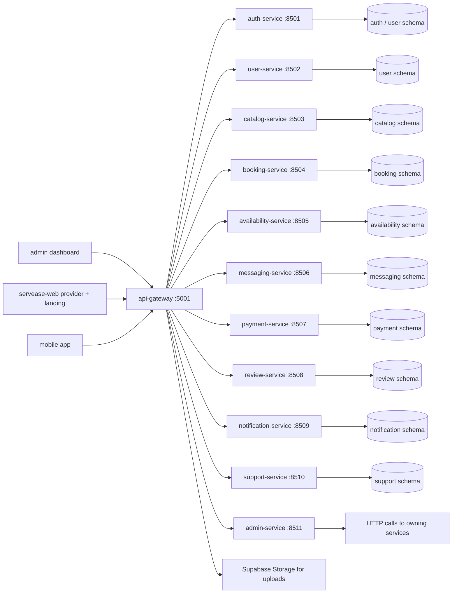

# ServEase Full-Stack Integration Audit

Date: 2026-05-21  
Documentation path refresh: 2026-05-23
Branch: `mobile-mvvm-structure`  
Architecture constraint: clients must call the API Gateway on port `5001` or a deployed/tunneled equivalent, never internal service ports.

## 1. Surface Status

| Surface | Builds? | Tests pass? | Gateway-only? | Broken endpoints | Notes |
| --- | --- | --- | --- | --- | --- |
| `backend/` | Yes, `npm run build` | Yes, 101 suites / 360 tests | Yes for client entrypoint; gateway proxies to service URLs | None after route-order fixes | All health endpoints responded on `5001`, `8501`-`8511`; `npm run smoke:health` passed. |
| `admin/` | Yes, `npm run build` | Yes, Vitest 16 files / 55 tests | Yes | None found | Env points to `http://localhost:5001`; auth token comes from Supabase password grant, then Bearer token is sent to gateway. |
| `servease-web/` | Yes, `npm run build` | Yes, script tests completed | Yes | None found | This repo identifies `servease-web/` as the merged landing page plus provider dashboard under `/provider/*`. |
| `mobile/` | Yes, `npx expo export --platform web --output-dir /tmp/servease-mobile-export` | Yes, 175 tests | Yes by client code; active `.env` uses ngrok URL | None found | `.env.example` points to `5001`; active `.env` is an ngrok URL and must terminate at gateway. |

## 2. Endpoint Inventory

All listed frontend calls either use gateway `/v1/*`, local Next `/api/*` proxies that forward to gateway, or Supabase browser auth for password-token issuance.

| Frontend | Client/proxy endpoint(s) | Gateway owner / downstream service |
| --- | --- | --- |
| `admin` | `POST /auth/v1/token?grant_type=password` | Supabase Auth token issuance only |
| `admin` | `GET/PATCH/DELETE /v1/me`, `PATCH /v1/me/password`, `GET /v1/me/sessions`, `POST /v1/me/two-factor/{enable,verify,disable}`, `GET/PUT /v1/me/preferences` | api-gateway -> auth/user-service |
| `admin` | `GET /v1/admin/bookings`, `GET /v1/admin/bookings/summary`, `GET /v1/admin/bookings/operations/alerts`, `GET /v1/admin/bookings/:id`, `POST /v1/admin/bookings/:id/{cancel,escalate,provider-messages,messages}`, `GET /v1/admin/bookings/:id/messages` | api-gateway -> admin-service -> booking-service |
| `admin` | `GET /v1/admin/support/tickets`, `GET /v1/admin/support/tickets/:id`, `PATCH /v1/admin/support/tickets/:id/{status,assignee}`, `GET/POST /v1/admin/support/tickets/:id/replies` | api-gateway -> admin-service -> support-service |
| `admin` | `GET /v1/admin/payments`, `GET /v1/admin/payments/failures`, `GET/PATCH /v1/admin/payments/:id`, `POST /v1/admin/payments/:id/{failure,retry,apicenter-sync,release}`, `GET /v1/admin/payments/payouts`, `PATCH /v1/admin/payments/payouts/:id/status` | api-gateway -> admin-service/payment-service |
| `admin` | `GET /v1/admin/settlements`, `POST /v1/admin/settlements/:id/{approve,reject,reconcile}`, `GET /v1/admin/settlements/:id/history`, `GET /v1/admin/refunds`, `POST /v1/admin/refunds/:id/{approve,reject}` | api-gateway -> payment-service |
| `admin` | `GET/PATCH /v1/admin/commission-rules`, `GET/POST/PATCH/DELETE /v1/admin/promotions`, `GET/POST /v1/admin/broadcasts` | api-gateway -> payment/admin-service/notification-service |
| `admin` | `GET /v1/admin/catalog/categories`, `POST/PATCH/DELETE /v1/admin/catalog/categories/:id`, `GET/POST/PATCH/DELETE /v1/admin/catalog/services/:id`, `GET /v1/catalog/{categories,services,providers}` | api-gateway -> catalog-service |
| `admin` | `GET /v1/admin/providers`, `GET/PATCH /v1/admin/providers/:id`, `GET/DELETE /v1/admin/providers/:id/portfolio/:mediaId` | api-gateway -> catalog-service |
| `admin` | `GET /v1/admin/provider-applications`, `GET /v1/admin/provider-applications/:id`, `GET /v1/admin/provider-applications/:id/documents/:documentId`, `GET/PUT /v1/admin/provider-applications/:id/review`, `POST /v1/admin/provider-applications/:id/{approve,reject,request-info}`, `POST /v1/admin/provider-applications/:id/review/notes` | api-gateway -> admin-service/catalog-service/notification-service |
| `admin` | `GET/PATCH /v1/admin/reviews/:id/flag`, `GET /v1/admin/disputes`, `GET /v1/admin/disputes/:id`, `POST /v1/admin/disputes/:id/resolve` | api-gateway -> review-service/booking-service |
| `admin` | `GET /v1/admin/pricing/{rules,fuel-index,quote-audits}`, `PUT /v1/admin/pricing/rules`, `POST /v1/admin/pricing/fuel-index`, `POST /v1/admin/pricing/fuel-index/sync` | api-gateway -> payment-service pricing engine |
| `admin` | `GET /v1/admin/reports/{revenue,users,financial,bookings}.csv`, `GET /v1/admin/reports/:type.pdf`, `POST /v1/admin/reports/:type`, `GET/POST /v1/admin/reports/:type/schedules`, `GET /v1/admin/audit-logs`, `GET /v1/admin/audit-logs/export`, `GET/PATCH/POST /v1/admin/integrations` | api-gateway -> admin-service and gateway aggregators |
| `servease-web` provider dashboard | `POST /auth/v1/token?grant_type=password` | Supabase Auth token issuance only |
| `servease-web` provider dashboard | `/v1/me`, `/v1/me/password`, `/v1/me/preferences`, `/v1/me/sessions`, `/v1/me/two-factor`, `/v1/me/two-factor/{enable,verify,disable}` | api-gateway -> auth/user-service |
| `servease-web` provider dashboard | `/v1/provider/{profile,dashboard,services}`, `PUT /v1/provider/services`, `POST /v1/provider/pricing/guidance` | api-gateway -> catalog-service/payment-service |
| `servease-web` provider dashboard | `/v1/provider/availability`, `/v1/provider/availability/:providerId`, `/v1/provider/availability/windows`, `/v1/provider/availability/days-off/:offDate` | api-gateway -> availability-service |
| `servease-web` provider dashboard | `/v1/bookings`, `/v1/bookings?scope=provider`, `/v1/bookings/:id`, `/v1/bookings/:id/{status,tracking,attachments,disputes,service-updates}` | api-gateway -> booking-service |
| `servease-web` provider dashboard | `/v1/conversations`, `/v1/conversations/:id/messages`, `/v1/notifications`, `/v1/notifications/:id/read` | api-gateway -> messaging-service/notification-service |
| `servease-web` provider dashboard | `/v1/payments`, `/v1/payments/{payout-account,payout-methods,payouts}`, `/v1/catalog/provider/portfolio`, `/v1/catalog/provider/portfolio/:id`, `/v1/catalog/provider/portfolio/order`, `/v1/uploads` | api-gateway -> payment-service/catalog-service/Supabase Storage |
| `servease-web` provider dashboard | `/v1/reviews?providerId=:id`, `/v1/reviews/:id/{reply,flag}`, `/v1/support/tickets`, `/v1/support/tickets/:id/replies`, `/v1/referrals`, `/v1/geo/directions` | api-gateway -> review/support/user services |
| `servease-web` public/landing | local `/api/*` routes for `me`, `bookings`, `payments`, `notifications`, `referrals`, `reviews`, `support-tickets`, `provider-registration`, `customer-registration`, `password-reset`, `pricing/quotes`, `provider-application/status`, `conversations` | Next proxy -> api-gateway -> owning services |
| `servease-web` public/landing | direct server fetches `/v1/catalog/{categories,services,service-areas,providers}`, `/v1/catalog/providers/:id/portfolio`, `/v1/provider/availability/:id`, `/v1/reviews?providerId=:id`, `/v1/uploads` | api-gateway -> catalog/availability/review/storage |
| `mobile` | `POST /auth/v1/token?grant_type=password` | Supabase Auth token issuance only |
| `mobile` | `/v1/auth/{register,password-reset,otp/generate,otp/verify,google/authorize,google/token,provider-application/me,provider-application/me/documents}` | api-gateway -> auth-service |
| `mobile` | `/v1/me`, `/v1/me/password`, `/v1/me/addresses`, `/v1/me/preferences`, `/v1/me/sessions`, `/v1/me/two-factor`, `/v1/me/two-factor/{enable,verify,disable}` | api-gateway -> auth/user-service |
| `mobile` | `/v1/catalog/{categories,services,service-areas,providers}`, `/v1/catalog/providers/:id/portfolio`, `/v1/catalog/provider/portfolio`, `/v1/catalog/provider/portfolio/:id`, `/v1/catalog/provider/portfolio/order` | api-gateway -> catalog-service |
| `mobile` | `/v1/bookings`, `/v1/bookings?scope=provider`, `/v1/bookings/:id`, `/v1/bookings/:id/{status,attachments,disputes,service-updates,timeline,tracking,tracking/location}` | api-gateway -> booking-service |
| `mobile` | `/v1/pricing/quotes`, `/v1/payments`, `/v1/payments/checkout-sessions`, `/v1/payments/checkout-sessions/:id/status`, `/v1/payments/promotions/validate`, `/v1/payments/methods`, `/v1/payments/methods/:id`, `/v1/payments/{payout-account,payout-methods,payouts}` | api-gateway -> payment-service |
| `mobile` | `/v1/conversations`, `/v1/conversations/:id/messages`, `/v1/notifications`, `/v1/notifications/:id/read`, `/v1/notifications/devices`, `/v1/notifications/devices/:token` | api-gateway -> messaging/notification services |
| `mobile` | `/v1/provider/{profile,dashboard,services}`, `/v1/provider/availability`, `/v1/provider/availability/:id`, `/v1/provider/availability/{windows,days-off,time-off}`, `/v1/provider/availability/days-off/:date`, `/v1/provider/availability/time-off/:id` | api-gateway -> catalog/availability services |
| `mobile` | `/v1/reviews`, `/v1/reviews?providerId=:id`, `/v1/reviews/:id/{reply,flag}`, `/v1/support/tickets`, `/v1/support/tickets/:id`, `/v1/support/tickets/:id/replies`, `/v1/referrals`, `/v1/geo/{geocode,reverse-geocode,geofence/check,directions}`, `/v1/uploads` | api-gateway -> review/support/user/storage |

## 3. Issues Found

### CRITICAL

- None verified.

### HIGH

- Backend Nest route declaration drift: several controllers had static routes declared below parameterized routes, which can route static paths through catch-all handlers in Nest/Express. This violated the explicit repository constraint even where method differences made some cases low-risk.

### MEDIUM

- `mobile/.env` uses `https://tamera-prepyloric-superacutely.ngrok-free.dev` rather than a visible `localhost:5001` gateway URL. No internal service port is used, but the audit cannot prove from repo state that the tunnel terminates at API Gateway.
- The public web and provider dashboard surface is `servease-web/`; no separate web workspace is active in the current repository.

### LOW

- Orphaned or non-frontend routes exist by design: `POST /v1/payments/webhooks/apicenter` is an external webhook; `GET /v1/auth/otp/:otpId/status`, `POST /v1/auth/google/token/refresh`, and `POST /v1/auth/google/logout` are gateway auth capabilities not currently called by the audited clients.
- Admin contains non-calling `notifyBackendRequired(...)` labels for future service-area/report-schedule actions. These are not live API calls and were not counted as broken client endpoints.

## 4. Fixes Applied

- `backend/apps/api-gateway/src/features/admin/admin-report.controller.ts`: moved static CSV exports before parameterized report routes.
- `backend/apps/api-gateway/src/features/availability/availability.controller.ts`: moved static availability mutation routes before `:providerId`.
- `backend/apps/api-gateway/src/features/booking/booking.controller.ts`: moved `POST /v1/bookings` before booking-id routes.
- `backend/apps/api-gateway/src/features/catalog/catalog.controller.ts`: moved portfolio reorder before parameterized portfolio media routes.
- `backend/apps/api-gateway/src/features/notifications/notification.controller.ts`: moved device registration routes before notification-id route.
- `backend/apps/api-gateway/src/features/support/support.controller.ts`: moved support-ticket creation before ticket-id routes.
- `backend/apps/catalog-service/src/features/provider-profile/provider-profile.controller.ts`: moved static provider/application/portfolio routes before parameterized routes.
- `backend/apps/notification-service/src/features/notifications/notification.controller.ts`: moved device routes before notification-id route.
- `backend/apps/payment-service/src/features/payments/payment-admin.controller.ts`: removed decorator-shaped text from a comment so route scans do not produce false positives.
- `backend/apps/payment-service/src/features/payments/payment.controller.ts`: moved checkout webhook before checkout-id status route.
- `backend/apps/review-service/src/features/reviews/review.controller.ts`: moved admin review listing before review-id routes.
- `backend/apps/support-service/src/features/tickets/ticket.controller.ts`: moved support-ticket creation before ticket-id routes.

Commits created:

- `9c6bcaf fix(backend): integration audit fixes`
- `977fd72 fix(admin): integration audit fixes`
- `68cc6e7 fix(servease-web): integration audit fixes`
- `f675577 fix(mobile): integration audit fixes`
- `a410b2f fix(servease-web): integration audit fixes`

## 5. Issues Not Fixed

- `mobile/.env` ngrok gateway target could not be proven from repository state. Recommended next step: document the tunnel owner/target or use a named deployed gateway URL for shared environments.
- Native mobile builds (`ios`/`android`) and Detox E2E were not run because the requested audit did not provide simulator/device requirements and `mobile` has no package build script. Web export, typecheck, lint, and unit tests were run instead.

## 6. Verification Evidence

Backend:

- `npm run lint:check`: passed.
- `npm run build`: passed.
- `npm test -- --runInBand`: 101 suites passed, 360 tests passed.
- `npm run smoke:health`: passed for read-only ports `8700`-`8711`.
- Direct health checks returned 200 for `5001`, `8501`, `8502`, `8503`, `8504`, `8505`, `8506`, `8507`, `8508`, `8509`, `8510`, `8511`.
- Route-order scan after fixes: no same-method static-after-parameterized controller routes found.

Admin:

- `npm run env:check`: passed.
- `npm run test`: Vitest 16 files passed, 55 tests passed.
- `npm run typecheck`: passed.
- `npm run lint`: passed.
- `npm run build`: passed.

servease-web / merged landing page:

- `npm test`: passed.
- `npm run typecheck`: passed.
- `npm run lint`: passed.
- `npm run build`: passed.

Mobile:

- `npm run typecheck`: passed.
- `npm test`: 175 tests passed.
- `npm run lint`: passed.
- `npm run env:prod`: passed.
- `npx expo export --platform web --output-dir /tmp/servease-mobile-export`: passed.

## 7. Architecture Diagram

