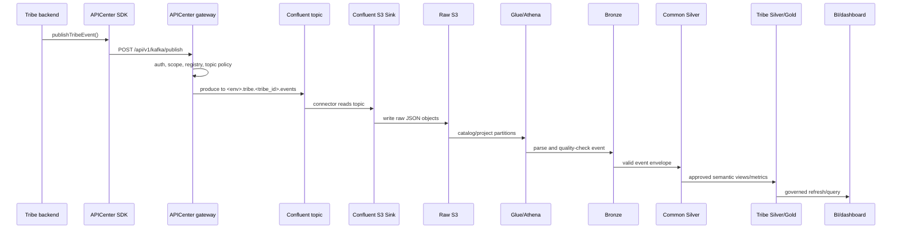

# Tribe Data Pipeline Manual

Date: 2026-05-21

Status: tribe-facing source-of-truth guide for APICenter event publishing,
Common Silver consumption, optional Tribe Silver/Gold, and BI handoff.

This manual is written for product tribe teams that publish APICenter events
and later consume curated analytics through Athena, BI, dashboards, or tribe
data products.

Read this as your tribe's data-pipeline handoff manual. The examples use sample
tribes such as `logistics` and `servease`; replace them with your own tribe ID,
service IDs, event names, and metric definitions.

It starts after a tribe backend uses the SDK to publish an event and follows
that event through Confluent, S3, Raw, Bronze, Common Silver, Tribe Silver, and
Gold.

For SDK installation, shared-service calls, and `publishTribeEvent()` examples,
see `../../../api-shared-services/docs/tribe-sdk-shared-services-manual.md`.

## How To Use This Manual

Use this manual when a product tribe asks any of these questions:

- "What do we need to set up before publishing events?"
- "Where do our events go after `publishTribeEvent()` returns accepted?"
- "Where will PowerBI, Looker, or our dashboard read from?"
- "What evidence proves our tribe is ready for production reporting?"
- "What does APICenter own, and what does our tribe own?"

This manual is intentionally tribe-facing. It does not assume the tribe has
Confluent, S3, Glue, Athena, or Databricks access. The normal tribe integration
surface is APICenter plus the SDK. APICenter owns the shared pipeline mechanics.
The tribe owns the business event meaning, field classification, and metric
definitions.

If you only need the direct answer:

```text
Publish events through the SDK.
Ask APICenter to validate the pipeline evidence.
Start analytics from Common Silver.
Use approved Tribe Silver or Gold for BI.
Do not use raw S3 as a reporting source.
```

## Tribe Action Map

| Phase | Tribe team does | APICenter platform does | Output |
| --- | --- | --- | --- |
| Service setup | Install SDK, configure `APICENTER_*`, register source service IDs. | Register tribe/service, issue secret, approve scopes. | Backend can authenticate. |
| Event design | Define event types, stable keys, payload fields, schema versions, PII classification. | Review schema, classification, topic ownership, quotas. | Event contract is approved for test. |
| Publish | Call `publishTribeEvent()` from backend code. | Authenticates, checks scopes, resolves topic, writes to Kafka. | SDK returns `accepted: true`. |
| Export | Wait for connector flush window. | Confirms Confluent topic, S3 Sink inclusion, raw S3 object. | Raw evidence exists. |
| Quality | Fix malformed events when platform reports issues. | Applies catalog, validates Bronze and Common Silver. | Valid rows appear in Common Silver. |
| Curate | Define semantic data products and business metrics. | Generates/reviews Tribe Silver and Gold SQL. | Approved Silver/Gold objects. |
| BI | Connect BI to governed query layer. | Grants approved reader groups and result prefixes. | Dashboard reads curated data only. |

## 1. The Short Version

Your tribe publishes business events through APICenter:

```text
tribe backend
  -> @implementsprint/sdk publishTribeEvent()
  -> APICenter governance
  -> Confluent Cloud topic
  -> Confluent S3 Sink
  -> raw S3
  -> Athena Raw table
  -> Bronze parsed views
  -> Common Silver standard envelope
  -> optional Tribe Silver and Gold
  -> approved dashboards, BI, APIs, or APICenter management
```

The same path as a sequence:



Your tribe does not need Confluent or S3 writer credentials for ordinary
APICenter event export. The platform owns the shared ingestion path. Your tribe
owns the business meaning of the events and the curated metrics built from
them.

The first working goal is not "BI dashboard exists." The first working goal is:

```text
one smoke event accepted by APICenter
  -> raw S3 object observed
  -> Bronze row parsed
  -> Common Silver row returned
```

After that, the tribe and platform decide whether a Tribe Silver or Gold data
product is needed for reporting.

## 2. Current Environment Status

Right now, your tribe integration starts in the test lane.

Use this as the current assumption for tribe teams:

```text
your current lane: test.tribe.<tribe_id>.events
your current status: test validation only
production status: gated, not active unless APICenter explicitly approves it
```

That means:

- test topics can be used for SDK, Confluent, S3, Raw, Bronze, Common Silver,
  and curated dry-run validation
- production examples in this manual describe the target gate, not the current
  default state for your tribe
- do not build a production dashboard from `prod.tribe.<tribe_id>.events` until
  APICenter records prod approval and fresh prod evidence for your tribe
- production evidence must be collected separately even if the test lane works

The production pilot lane is separate from your tribe onboarding. Unless the
APICenter platform team says your tribe has an approved prod topic, assume your
tribe is test-only.

## 3. Who Owns What

| Area | Platform/APICenter owns | Tribe owns |
| --- | --- | --- |
| SDK runtime path | Gateway, auth, scopes, registry, Kafka publisher | Calling the SDK correctly from your backend |
| Topic governance | Naming rules, environment prefixes, topic ACLs | Which domain events should exist |
| Raw landing | Confluent S3 Sink, raw S3 bucket, object layout | Publishing valid events that deserve export |
| Catalog | Glue/Athena raw table and projection values | Confirming expected event volume and dates |
| Bronze | Parsing, quality status, required envelope fields | Fixing invalid payloads and missing fields |
| Common Silver | Standard cross-tribe event envelope | Using the shared fields correctly |
| Tribe Silver | Infrastructure template and review support | Domain transformations and semantic rules |
| Gold | Platform metric standards and access gates | Business metric definitions and dashboard meaning |
| Access | IAM, workgroups, result prefixes, guardrails | Approved readers and data steward decisions |

Practical rule:

```text
APICenter owns the pipeline mechanics.
The tribe owns the domain meaning.
```

## 4. Topic Model

The default topic model is one event lane per owner tribe per environment.

Logical topic:

```text
tribe.<ownerTribeId>.events
```

Physical topics:

```text
test.tribe.<ownerTribeId>.events
prod.tribe.<ownerTribeId>.events
```

Example:

```text
logical topic: tribe.logistics.events
test topic:    test.tribe.logistics.events
prod topic:    prod.tribe.logistics.events
```

Microservices do not get separate Kafka topics by default. They publish to the
owner tribe topic and identify themselves with `sourceServiceId`.

Example:

```json
{
  "topic": "tribe.logistics.events",
  "sourceServiceId": "logistics-orders",
  "eventType": "order.created",
  "payload": {
    "orderId": "order-123",
    "amount": 99900,
    "currency": "PHP",
    "occurredAt": "2026-05-21T00:00:00.000Z"
  },
  "metadata": {
    "schemaVersion": "1"
  }
}
```

APICenter applies `test.` or `prod.` when it writes to Kafka. Tribe producers
should publish the base owner-tribe topic through the SDK.

For your tribe right now, the physical topic to validate is the test topic:

```text
test.tribe.<ownerTribeId>.events
```

Only use the prod physical topic after APICenter creates an approval record,
includes your topic in the prod S3 Sink, applies catalog/projection changes,
and validates prod raw-to-curated evidence.

## 5. Required Tribe Handoff

Before test export, the tribe and platform should fill this handoff. Before
production export, the same handoff must be reviewed again with production
reader groups, production topic approval, and production validation evidence.

```text
owner_tribe_id:
source_service_ids:
environment:
logical_topic:
physical_topic:
event_owner:
data_steward:
schema_owner:
classification_tier:
retention_tier:
approved_reader_groups:
expected_daily_volume:
publish_quota:
event_size_limit:
event_types:
metric_names:
dashboard_or_bi_consumers:
```

What each field means:

| Field | Meaning | Example |
| --- | --- | --- |
| `owner_tribe_id` | The tribe principal used by APICenter auth and topic ownership. | `logistics` |
| `source_service_ids` | Registered backend services that will publish events. | `logistics-orders`, `logistics-inventory` |
| `environment` | `test` first, then `prod` after approval. | `test` |
| `logical_topic` | Topic the SDK publishes to before environment prefixing. | `tribe.logistics.events` |
| `physical_topic` | Topic APICenter writes to in Kafka. | `test.tribe.logistics.events` |
| `event_owner` | Person/team accountable for event meaning. | `logistics-orders-team` |
| `data_steward` | Person/team accountable for classification, retention, readers. | `logistics-data-steward` |
| `schema_owner` | Person/team that approves payload shape and schema changes. | `logistics-platform` |
| `classification_tier` | Sensitivity level for the event and payload fields. | `internal`, `confidential`, `restricted` |
| `retention_tier` | How long curated data may be retained. | `standard-365`, `finance-7y` |
| `approved_reader_groups` | IAM/BI groups allowed to read curated outputs. | `logistics-bi-readers` |
| `expected_daily_volume` | Expected event count used for quotas and cost guardrails. | `50000` |
| `publish_quota` | Rate/volume allowed at APICenter publish boundary. | `100 rps`, `1M/day` |
| `event_size_limit` | Maximum payload size accepted for this event family. | `64 KB` |
| `event_types` | Approved event names. | `order.created`, `delivery.completed` |
| `metric_names` | Gold or dashboard metrics expected from the events. | `fulfillment_daily` |
| `dashboard_or_bi_consumers` | Where curated data will be used. | PowerBI dataset, tribe dashboard |

Each event type should also have:

```text
event_type:
schema_version:
stable_key_rule:
occurred_at_rule:
required_payload_fields:
optional_payload_fields:
pii_fields:
redacted_or_tokenized_fields:
breaking_change_approver:
production_metric_dependencies:
```

No production dashboard should depend on an event until this is approved.

The tribe should treat the handoff as a contract, not a ticket comment. If an
event field is not listed, classified, and approved, do not use it in production
BI.

## 6. Event Contract

Use `publishTribeEvent()` for ordinary business events:

```ts
await apiCenter.publishTribeEvent({
  sourceServiceId: 'logistics-orders',
  key: 'order-123',
  eventType: 'order.created',
  payload: {
    orderId: 'order-123',
    customerRef: 'cus_hash_456',
    amount: 99900,
    currency: 'PHP',
    status: 'created',
    occurredAt: '2026-05-21T00:00:00.000Z',
  },
  metadata: {
    schemaVersion: '1',
    classification: 'internal',
  },
});
```

Required event principles:

- `sourceServiceId` is the registered backend that produced the event.
- `key` is a stable domain ID, such as order ID, booking ID, invoice ID, or
  enrollment ID.
- `eventType` uses `domain.event_name`, for example `order.created`.
- `payload` is an object with business fields.
- `payload.occurredAt` should be the actual business event time in UTC.
- `metadata.schemaVersion` should be stable and reviewed before production.

Do not publish secrets, raw tokens, OTP codes, raw email or SMS bodies,
passwords, provider credentials, or unnecessary PII.

### 6.1 Tribe-Side Runtime Setup

Install the SDK in your backend service:

```powershell
npm install @implementsprint/sdk
```

Configure backend-only environment variables. Do not expose these in frontend
code.

```env
APICENTER_URL=https://api-center.itsandbox.site
APICENTER_TRIBE_ID=logistics
APICENTER_TRIBE_SECRET=<provided-by-apicenter>
APICENTER_SERVICE_ID=logistics-orders
```

Rules:

- `APICENTER_TRIBE_ID` is the owning tribe, not the microservice.
- `APICENTER_SERVICE_ID` is the backend service producing the event.
- `APICENTER_TRIBE_SECRET` stays server-side only.
- The source service must be registered under the owner tribe before production.

Create a single backend client:

```ts
import { TribeClient } from '@implementsprint/sdk';

export const apiCenter = new TribeClient({
  gatewayUrl: process.env.APICENTER_URL!,
  tribeId: process.env.APICENTER_TRIBE_ID!,
  secret: process.env.APICENTER_TRIBE_SECRET!,
  sourceServiceId: process.env.APICENTER_SERVICE_ID!,
});
```

Prefer a small domain wrapper instead of scattering raw publish calls:

```ts
type OrderCreatedEvent = {
  orderId: string;
  customerRef: string;
  amount: number;
  currency: 'PHP';
  status: 'created';
  occurredAt: string;
};

export async function publishOrderCreated(event: OrderCreatedEvent) {
  return apiCenter.publishTribeEvent({
    key: event.orderId,
    eventType: 'order.created',
    payload: event,
    metadata: {
      schemaVersion: '1',
      classification: 'internal',
    },
  });
}
```

This pattern keeps event naming, schema versioning, and classification in one
place. It also lets the tribe add tests around the event contract before the
event becomes a dashboard dependency.

### 6.2 What `accepted: true` Means

An accepted SDK response means APICenter accepted the event for governed Kafka
publishing:

```json
{
  "accepted": true,
  "topic": "tribe.logistics.events",
  "eventType": "order.created"
}
```

It means:

- the tribe authenticated
- the token had the Kafka publish scope
- the event topic matched the authenticated tribe
- APICenter accepted the publish request

It does not mean:

- Confluent S3 Sink has flushed the record
- S3 raw object already exists
- Bronze parsed the event
- Common Silver contains a row
- BI can use the event

The tribe should store the publish timestamp, source service ID, event type,
stable key, and response in application logs so platform operators can correlate
it with S3 and Athena evidence.

### 6.3 Event Design Rules From The Tribe Side

Design events as business facts, not UI clicks or database dumps.

Good event examples:

```text
order.created
order.cancelled
delivery.completed
booking.completed
provider.rated
invoice.created
```

Avoid:

```text
button.clicked
row.updated
save.form
api.called
payment.secret.saved
```

Use stable payload names and stable units:

```json
{
  "orderId": "ord_123",
  "customerRef": "cus_hash_456",
  "amountMinor": 99900,
  "currency": "PHP",
  "status": "created",
  "occurredAt": "2026-05-21T00:00:00.000Z"
}
```

Document units in the schema review. For money, prefer minor units such as
centavos/cents and name the field clearly, for example `amountMinor`.

For every event type, decide:

- what business event happened
- what stable key identifies it
- which service produced it
- which fields are required
- which fields are optional
- which fields are sensitive
- what values are allowed for enum-like fields
- whether the event can be replayed
- whether duplicates are possible and how BI should handle them

## 7. Data Lifecycle

### Stage 1: SDK Publish Accepted

Your SDK call returns something like:

```json
{
  "accepted": true,
  "topic": "tribe.logistics.events",
  "eventType": "order.created"
}
```

This means APICenter accepted the event for Kafka publishing. It proves:

- your tribe authenticated
- your token had publish scope
- the topic belonged to your tribe
- the payload passed APICenter's publish checks

It does not prove S3 or BI yet.

### Stage 2: Physical Kafka Topic

APICenter writes to the environment-prefixed physical topic:

```text
test.tribe.logistics.events
prod.tribe.logistics.events
```

The platform validates:

- topic exists in Confluent
- topic ACLs allow APICenter to produce
- topic follows owner-tribe naming rules
- production schema is approved before prod writes

### Stage 3: Confluent S3 Sink

The managed connector exports topic records to S3:

```text
s3://api-center-raw-data/topics/<physical_topic>/year=YYYY/month=MM/day=DD/hour=HH/*.json
```

Example:

```text
s3://api-center-raw-data/topics/prod.tribe.logistics.events/year=2026/month=05/day=20/hour=18/
```

S3 export can lag because the connector may flush by time interval or record
batch size. A single test event may not immediately create a visible S3 object.

### Stage 4: Raw Catalog

Raw S3 is cataloged in Athena through partition projection. The platform tracks
approved physical topics in:

```text
api-center/infra/aws-data-pipeline/topic-projection-values.txt
```

Raw table responsibilities:

- expose the physical topic
- expose partition fields such as year, month, day, hour
- keep raw event records available for platform validation

Raw S3 is platform-only. Tribes and BI users should not read raw S3 directly.

### Stage 5: Bronze

Bronze parses raw records and assigns quality status.

Current tribe event view:

```text
bronze.tribe_events
```

Bronze extracts:

```text
source_topic
environment
tribe_id
source_service_id
event_type
schema_version
occurred_at
ingested_at
quality_status
quality_error
year
month
day
hour
raw_record
```

Bronze marks records invalid when required fields are missing or malformed. A
record can reach raw S3 and still fail Bronze quality checks.

### Stage 6: Common Silver

Common Silver is the shared source-of-truth envelope across tribes:

```text
common_silver.tribe_event_envelope
```

Normal tribe analytics should start from Common Silver, not raw S3 or Bronze.

Common Silver:

- includes only valid tribe events
- standardizes environment, tribe, service, event type, and schema fields
- keeps enough traceability to find raw records when platform operators need it
- allows APICenter to compare health and quality across tribes

Common Silver does not decide your domain metric meaning. It only gives every
tribe a consistent base envelope.

Common Silver fields currently exposed for tribe events:

```text
source_topic
environment
tribe_id
source_service_id
event_type
schema_version
schema_validation_status
schema_registry_version
schema_validation_error
occurred_at
ingested_at
quality_status
quality_error
year
month
day
hour
raw_record
```

The platform may add more standardized fields over time. Tribes should treat the
listed columns as the stable handoff and should not depend on raw S3 object
layout for BI.

Example filter a tribe should expect APICenter or an approved query endpoint to
use:

```sql
SELECT
  environment,
  tribe_id,
  source_service_id,
  event_type,
  COUNT(*) AS event_count,
  MAX(occurred_at) AS latest_occurred_at
FROM common_silver.tribe_event_envelope
WHERE environment = 'test'
  AND tribe_id = 'logistics'
  AND source_service_id = 'logistics-orders'
  AND event_type = 'order.created'
  AND year = '2026'
  AND month = '05'
  AND day = '21'
GROUP BY 1, 2, 3, 4;
```

Important query rules:

- filter by `environment`
- filter by `tribe_id`
- filter by `event_type`
- use bounded `year`, `month`, `day`, and when possible `hour`
- do not run broad cross-topic scans for normal dashboard refreshes
- do not mix test and prod in the same dataset

If Common Silver returns zero rows, do not jump straight to BI debugging. Check
the evidence chain in order:

```text
SDK accepted
  -> raw S3 object exists
  -> raw Athena table sees the object
  -> Bronze row exists
  -> Bronze quality_status = valid
  -> Common Silver row exists
```

### Stage 7: Tribe Silver

Tribe Silver is where your tribe turns Common Silver rows into domain-specific
datasets.

Naming pattern:

```text
silver_<tribe_id>.<domain_event_type>
```

Examples:

```text
silver_logistics.order_created
silver_servease.booking_completed
silver_servease.provider_rated
```

Tribe Silver should:

- read from `common_silver.tribe_event_envelope`
- filter by `environment`
- filter by `tribe_id`
- filter by approved `event_type`
- parse only approved payload fields
- keep schema governance evidence
- avoid broad unbounded scans
- never mix test and prod rows

Example Tribe Silver shape:

```sql
CREATE OR REPLACE VIEW silver_logistics.order_created AS
SELECT
  tribe_id,
  source_service_id,
  event_type,
  schema_version,
  occurred_at,
  ingested_at,
  json_extract_scalar(raw_record, '$.payload.orderId') AS order_id,
  json_extract_scalar(raw_record, '$.payload.customerRef') AS customer_ref,
  CAST(json_extract_scalar(raw_record, '$.payload.amountMinor') AS bigint) AS amount_minor,
  json_extract_scalar(raw_record, '$.payload.currency') AS currency,
  year,
  month,
  day,
  hour
FROM common_silver.tribe_event_envelope
WHERE environment = 'prod'
  AND tribe_id = 'logistics'
  AND event_type = 'order.created'
  AND schema_validation_status = 'approved';
```

This is not something every tribe writes from scratch. The platform provides the
template and generator. The tribe supplies the semantic decisions:

- which event type becomes a Silver object
- which payload fields are safe to expose
- how fields should be named
- which filters are mandatory
- which reader group is allowed
- who signs off on correctness

### Stage 8: Gold

Gold is the metric and dashboard layer.

Naming pattern:

```text
gold_<tribe_id>.<metric_name>
```

Examples:

```text
gold_logistics.order_created_daily
gold_servease.booking_completion_daily
gold_servease.provider_quality_daily
```

Gold definitions need a metric dictionary entry:

```text
metric_name:
business_definition:
formula:
grain:
filters:
source_silver_object:
owner:
steward:
approved_reader_group:
production_approval:
```

BI dashboards should read Gold or approved Tribe Silver through a governed
query layer. They should not read raw S3.

Example Tribe Gold shape:

```sql
CREATE OR REPLACE VIEW gold_logistics.order_created_daily AS
SELECT
  CAST(substr(coalesce(occurred_at, ingested_at), 1, 10) AS date) AS metric_day,
  tribe_id,
  COUNT(*) AS order_created_count,
  COUNT(DISTINCT source_service_id) AS source_service_count,
  SUM(amount_minor) AS order_amount_minor_sum,
  MAX(occurred_at) AS latest_order_created_at
FROM silver_logistics.order_created
WHERE tribe_id = 'logistics'
GROUP BY 1, 2;
```

Gold is where BI should usually land. If a dashboard needs row-level details,
use approved Tribe Silver. If it needs KPIs, trend lines, and management
metrics, use Gold.

## 8. Common Silver Versus Tribe Silver

This distinction matters.

| Layer | Purpose | Who normally uses it |
| --- | --- | --- |
| Raw S3 | Immutable landing and platform forensic validation | Platform data operators |
| Bronze | Parsed records and quality checks | Platform operators and controlled jobs |
| Common Silver | Valid standardized event envelope | Platform jobs and approved tenant-filtered consumers |
| Tribe Silver | Tribe-specific semantic datasets | Owning tribe and approved readers |
| Gold | Business and operational metrics | BI, dashboards, management, approved tribe readers |

If a tribe asks, "Where do we get our data from?", the default answer is:

```text
Start from Common Silver for standard valid events.
Use approved Tribe Silver or Gold for dashboards and BI.
Do not use raw S3 as the reporting source.
```

## 9. Onboarding State Ladder

Each tribe topic moves through evidence-based states:

```text
Not configured
  -> Data classification ready
  -> Policy ready
  -> Topic provisioned
  -> Sink included
  -> Publishing
  -> Raw observed
  -> Bronze cataloged
  -> Curated active
```

State must advance from evidence, not assumptions.

| State | Evidence needed |
| --- | --- |
| Data classification ready | Field classification, owner, steward, retention, reader groups. |
| Policy ready | Tribe registered, scopes approved, event topic approved. |
| Topic provisioned | Physical Confluent topic exists. |
| Sink included | S3 Sink connector config includes physical topic. |
| Publishing | APICenter accepted a governed publish. |
| Raw observed | S3 object exists under exact physical topic prefix. |
| Bronze cataloged | Bronze returns parsed rows for the topic/date. |
| Curated active | Common Silver and approved Silver/Gold validation pass. |

## 10. Test And Prod Separation

Test and prod are separate lanes.

| Layer | Test | Prod |
| --- | --- | --- |
| Physical topic | `test.tribe.<tribe_id>.events` | `prod.tribe.<tribe_id>.events` |
| Raw S3 prefix | `topics/test.tribe...` | `topics/prod.tribe...` |
| Result prefix | validation or tribe test prefix | approved prod prefix |
| Use | development, smoke, validation | production reporting |
| Approval | lower friction | formal schema, reader, and metric approval |

Prod readiness requires fresh production evidence. Test success does not prove
prod.

For your tribe today, stop at the test lane unless there is an explicit
production approval. Your current validated path should be described as:

```text
test publish -> test Confluent topic -> test S3 raw prefix -> Raw/Bronze/Common Silver validation
```

Do not describe your tribe as production-ready just because the shared pipeline has a
production model.

Production validation should prove:

1. production topic exists
2. production S3 Sink includes the topic
3. production publish is accepted
4. production raw S3 object appears
5. Raw Athena returns rows
6. Bronze quality is acceptable
7. Common Silver returns rows
8. approved Silver/Gold returns rows
9. prod leak guard confirms no test data is included
10. BI reads approved prod outputs

## 11. How A New Tribe Gets Onboarded

Use this flow for each environment.

1. Register the tribe and source services in APICenter.
2. Complete data classification and ownership handoff.
3. Approve event types and schema versions for the environment.
4. Confirm `kafka` is approved in your service or tribe `consumes`, so the
   issued token includes `external:kafka:write`.
5. Resolve the logical topic `tribe.<ownerTribeId>.events`.
6. Provision physical topic `<environment>.tribe.<ownerTribeId>.events`.
7. Include the physical topic in the Confluent S3 Sink connector.
8. Add the physical topic to Athena projection values.
9. Reapply or validate the raw Athena catalog.
10. Publish a smoke event through the SDK.
11. Confirm APICenter accepted the publish.
12. Confirm Confluent received records.
13. Confirm S3 raw object arrival.
14. Validate Raw, Bronze, and Common Silver.
15. Generate or review Tribe Silver and Gold SQL.
16. Approve reader groups and result prefixes.
17. Connect dashboards only to approved Silver or Gold.

No pipeline rewrite should be required for a late-provisioned tribe. New tribes
enter the same state ladder and shared pipeline.

For your current rollout, run this flow for `test` first. Repeat the same flow
for `prod` only after your tribe has production approval.

## 12. What The Tribe Must Do From Its Side

This is the tribe-owned checklist. The platform cannot complete these decisions
for the tribe because they require domain knowledge.

### 12.1 Confirm The Event Is Worth Publishing

Publish events that answer real operational or reporting questions:

```text
How many orders were created?
How many bookings completed?
How long did fulfillment take?
Which source service produced the event?
Which provider or business flow is failing?
Which metric should appear in BI?
```

Do not publish events just because a database row changed. The event should
represent a business fact that downstream analytics can explain.

### 12.2 Own The Event Dictionary

Create a simple event dictionary before production:

```text
event_type: order.created
business_definition: An order was accepted by the logistics order service.
stable_key: orderId
source_service_id: logistics-orders
schema_version: 1
required_payload_fields:
  - orderId
  - customerRef
  - amountMinor
  - currency
  - status
  - occurredAt
optional_payload_fields:
  - promoCodeRef
pii_fields:
  - none, customerRef is hashed
retention_tier: standard-365
expected_daily_volume: 50000
downstream_metrics:
  - order_created_daily
  - fulfillment_daily
owner: logistics-orders-team
steward: logistics-data-steward
```

### 12.3 Add Backend Publishing Code

The tribe backend should publish after the business transaction commits. Avoid
publishing an event before the operation is durable in the tribe system.

Recommended pattern:

```ts
async function createOrder(input: CreateOrderInput) {
  const order = await ordersRepository.create(input);

  await publishOrderCreated({
    orderId: order.id,
    customerRef: order.customerHash,
    amountMinor: order.totalAmountMinor,
    currency: 'PHP',
    status: 'created',
    occurredAt: order.createdAt.toISOString(),
  });

  return order;
}
```

If the event publish fails after the order commits, decide whether your service
retries immediately, writes an outbox row, or alerts. For important production
metrics, an outbox/retry path is better than silently dropping events.

### 12.4 Log The Correlation Evidence

Log enough data to help APICenter trace a publish:

```json
{
  "message": "published APICenter tribe event",
  "ownerTribeId": "logistics",
  "sourceServiceId": "logistics-orders",
  "eventType": "order.created",
  "key": "order-123",
  "schemaVersion": "1",
  "publishedAt": "2026-05-21T10:15:30.000Z",
  "accepted": true
}
```

Do not log secrets or raw PII. Use hashed or tokenized references.

### 12.5 Verify Your Local Contract Before Asking For Platform Evidence

Before asking APICenter to debug S3 or Athena, confirm:

- the SDK can authenticate
- `APICENTER_TRIBE_ID` is the owner tribe
- `APICENTER_SERVICE_ID` is the registered backend service
- your token includes Kafka publish capability
- `publishTribeEvent()` returns `accepted: true`
- the event type and schema version match the approved dictionary
- the payload contains `occurredAt`
- no forbidden fields are present

### 12.6 Decide The BI Consumer Early

Tell APICenter which consumer will read the data:

| BI consumer | Tribe decision needed |
| --- | --- |
| PowerBI | Dataset owner, refresh cadence, reader group, required metrics. |
| Looker | Explore/model owner, semantic definitions, access group. |
| Tribe app dashboard | API owner, endpoint shape, cache/refresh behavior. |
| APICenter management | Whether this is a platform health metric or tribe-only metric. |

This changes which Gold metrics, result prefixes, reader groups, and refresh
controls are needed.

## 13. What Tribes Ask Platform To Validate

After publishing a smoke event, ask for this evidence:

```text
owner_tribe_id:
source_service_id:
environment:
logical_topic:
physical_topic:
publish_accepted_at:
confluent_topic_exists:
connector_name:
connector_state:
connector_includes_topic:
s3_prefix:
latest_s3_object_key:
latest_s3_object_at:
raw_query_id:
raw_record_count:
bronze_query_id:
bronze_valid_count:
bronze_quality_errors:
common_silver_query_id:
common_silver_count:
gold_query_id:
gold_metric_count:
prod_leak_guard_query_id:
prod_leak_guard_count:
```

For production, require an approval record before running prod validation:

```text
approved_prod_physical_topic:
owner_tribe_id:
source_service_ids:
data_owner:
data_steward:
approved_reader_groups:
metric_dictionary_rows_approved:
raw_prod_retention_days:
athena_workgroup:
bytes_scanned_limit:
operator:
approval_timestamp:
```

## 14. BI And Dashboard Handoff

BI tools should read curated data:

```text
Gold or approved Tribe Silver via a governed query layer.
```

Allowed patterns:

| Consumer | Reads from | Notes |
| --- | --- | --- |
| Tribe dashboard | `gold_<tribe_id>.*` or approved `silver_<tribe_id>.*` | Filter to correct environment. |
| PowerBI or Looker | Gold or approved Tribe Silver through Athena, Databricks SQL, or approved query endpoint | Use refresh, not manual raw downloads. |
| APICenter management | platform Gold and governance endpoints | Used for pipeline health and operations. |
| Platform validation | Bronze, Common Silver, Gold | Operator-only validation and remediation. |

Recommended BI handoff:

1. Tribe defines the metric and dashboard question.
2. Tribe and platform agree whether the source is Common Silver, Tribe Silver,
   or Gold.
3. Platform creates or approves the curated view.
4. Platform grants the approved reader group.
5. BI owner connects through the governed query layer.
6. BI owner sets a bounded refresh schedule.
7. Tribe data steward validates the first dashboard numbers against source
   system expectations.
8. Platform records the dashboard URL, metric owner, refresh cadence, and next
   review date.

PowerBI example target:

```text
source: Athena or Databricks SQL
dataset: gold_logistics.order_created_daily
filters:
  environment = prod
  tribe_id = logistics
refresh: daily or hourly, depending on approved cost budget
reader_group: logistics-bi-readers
owner: logistics-data-steward
```

Looker example target:

```text
explore: logistics_orders
base_view: gold_logistics.order_created_daily
required_filters:
  - environment
  - tribe_id
access_grant: logistics-bi-readers
semantic_owner: logistics-orders-team
```

Tribe dashboard API example:

```text
GET /analytics/orders/daily?from=2026-05-01&to=2026-05-21
  -> backend queries approved Gold or cached Gold extract
  -> frontend displays metrics
```

The frontend should not call Athena directly and should not receive
`APICENTER_TRIBE_SECRET`, AWS credentials, or raw S3 paths.

Avoid:

- dashboards reading raw S3
- manual CSV exports as the production reporting path
- mixing test and prod in one dataset
- using Gold metrics before the metric dictionary is approved

## 15. Example: Logistics

Source services:

```text
logistics-orders
logistics-inventory
logistics-delivery
```

Topics:

```text
test.tribe.logistics.events
prod.tribe.logistics.events
```

For your onboarding right now, use the test topic. Treat the prod topic as
future or approval-gated unless the APICenter platform team says your tribe has
completed production validation.

Events:

```text
order.created
inventory.checked
delivery.completed
```

Silver examples:

```text
silver_logistics.order_created
silver_logistics.inventory_checked
silver_logistics.delivery_completed
```

Gold examples:

```text
gold_logistics.order_created_daily
gold_logistics.delivery_completion_daily
gold_logistics.fulfillment_daily
```

The tribe owns the definitions of fulfillment and delivery completion. The
platform owns the mechanics that make those rows available from Common Silver.

## 16. Example: ServEase Booking

Source services:

```text
servease-booking
servease-payment
servease-provider
```

Topics:

```text
test.tribe.servease.events
prod.tribe.servease.events
```

Current assumption for this kind of tribe example: only
`test.tribe.servease.events` is active for validation. The prod topic is a
target after production approval, not a current requirement.

Events:

```text
booking.created
booking.completed
provider.rated
payment.authorized
```

Silver examples:

```text
silver_servease.booking_created
silver_servease.booking_completed
silver_servease.provider_rated
```

Gold examples:

```text
gold_servease.booking_completion_daily
gold_servease.provider_quality_daily
```

Sensitive customer and provider fields must be classified before production
export. Use hashed or tokenized references unless raw values are explicitly
approved.

## 17. Common Questions

### Do we need AWS or Confluent credentials?

No for normal tribe publishing. Your service uses the SDK and APICenter. The
platform owns Confluent and S3 writer credentials.

### Does every microservice get its own Kafka topic?

No by default. The topic is per owner tribe and environment. Microservice
identity goes in `sourceServiceId`.

### Does calling a shared service automatically create analytics events?

Not as a tribe domain event. Shared-service telemetry is platform-owned. If your
tribe needs a domain event for analytics, publish an explicit tribe event.

### Who creates `external:kafka:write`?

Your tribe does not create that scope. Ask the APICenter platform team to
approve the `kafka` capability in your service or tribe `consumes`. APICenter
then issues `external:kafka:write` in your token.

### Where should PowerBI or Looker read from?

Gold or approved Tribe Silver through a governed query layer such as Athena,
Databricks SQL, or an approved APICenter endpoint. Do not read raw S3 for
production dashboards.

### Can we download raw files from S3?

Not as the normal operating model. Raw S3 is platform-only. Ask for approved
curated access instead.

### If `publishTribeEvent()` returns accepted, is BI ready?

No. Accepted means APICenter accepted the event. BI readiness requires S3,
Raw, Bronze, Common Silver, and approved Silver/Gold evidence.

### Can test evidence approve prod?

No. Test proves the model. Prod needs production topic, production S3, production
query, production quality, and production access evidence.

### Is our tribe in prod right now?

Assume no. Your tribe is test-only right now unless the APICenter platform team
explicitly gives your tribe an approved prod topic and validation evidence. Use
test for your current pipeline walkthroughs, smoke checks, and demos.

## 18. Troubleshooting

| Symptom | Likely cause | What to do |
| --- | --- | --- |
| SDK publish returns `401` | Wrong tribe secret or tribe ID. | Check runtime env and Secret Manager handoff. |
| SDK publish returns `403` | `kafka` is not approved in `consumes`, `external:kafka:write` is missing from the token, or topic ownership failed. | Ask the APICenter platform team to approve `kafka`, check scopes, and confirm the owner tribe topic. |
| Publish accepted but no S3 object | Connector flush delay or connector does not include topic. | Ask the APICenter platform team to check S3 Sink config, tasks, and flush settings. |
| S3 object exists but Raw query returns zero | Projection/catalog missing physical topic or wrong partition. | Ask the APICenter platform team to check projection values and catalog apply. |
| Raw rows exist but Bronze invalid | Missing `eventType`, `sourceServiceId`, schema, or malformed payload. | Fix producer payload and schema metadata. |
| Common Silver returns zero | Bronze quality is invalid or filters do not match environment/tribe/event. | Check Bronze quality and filter values. |
| Gold returns zero | Metric SQL points to wrong event, date, environment, or unapproved Silver. | Review metric dictionary and generated SQL. |
| Dashboard mixes test/prod | Missing environment filter or wrong result prefix. | Stop dashboard refresh and repair filters before publishing. |

## 19. Tribe Production Readiness Checklist

- Tribe is registered in APICenter.
- Source service IDs are known and stable.
- Event owner and data steward are assigned.
- Event fields are classified.
- Event schema version is approved for prod.
- `kafka` is approved in `consumes` and `external:kafka:write` is issued to the
  tribe token.
- Logical topic is `tribe.<ownerTribeId>.events`.
- Physical prod topic is approved.
- S3 Sink includes the prod physical topic.
- Smoke publish returns `accepted: true`.
- Raw S3 object appears under the prod topic prefix.
- Raw Athena query returns expected rows.
- Bronze quality is acceptable.
- Common Silver returns expected rows.
- Tribe Silver SQL is approved if needed.
- Gold metric dictionary row is approved if BI depends on it.
- Prod leak guard passes.
- Reader groups are approved.
- BI/dashboard reads curated prod data only.

For your tribe today, do not mark this checklist complete. Your current
checklist is the test-lane version until APICenter approves prod.

## 20. Support Handoff Template

Use this when asking for platform help:

```text
tribe_id:
environment:
source_service_id:
event_type:
schema_version:
logical_topic:
physical_topic:
publish_timestamp:
publish_response:
correlation_id:
expected_s3_prefix:
expected_common_silver_filter:
expected_silver_object:
expected_gold_metric:
dashboard_or_bi_consumer:
business_impact:
```

Attach one sample event with secrets and sensitive fields removed.
